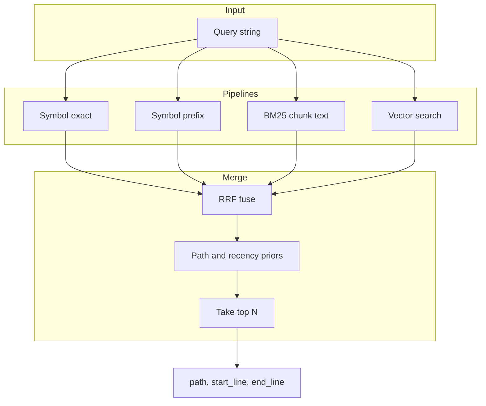
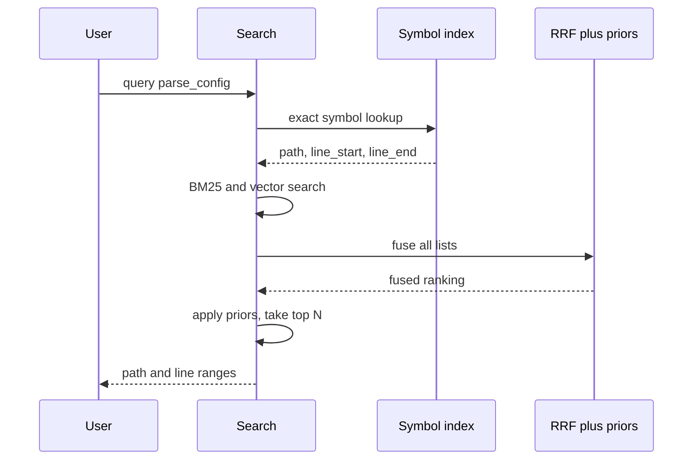
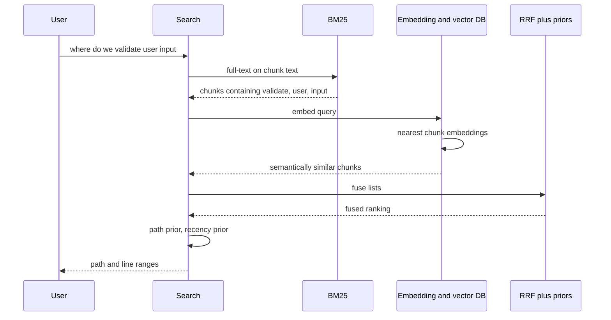
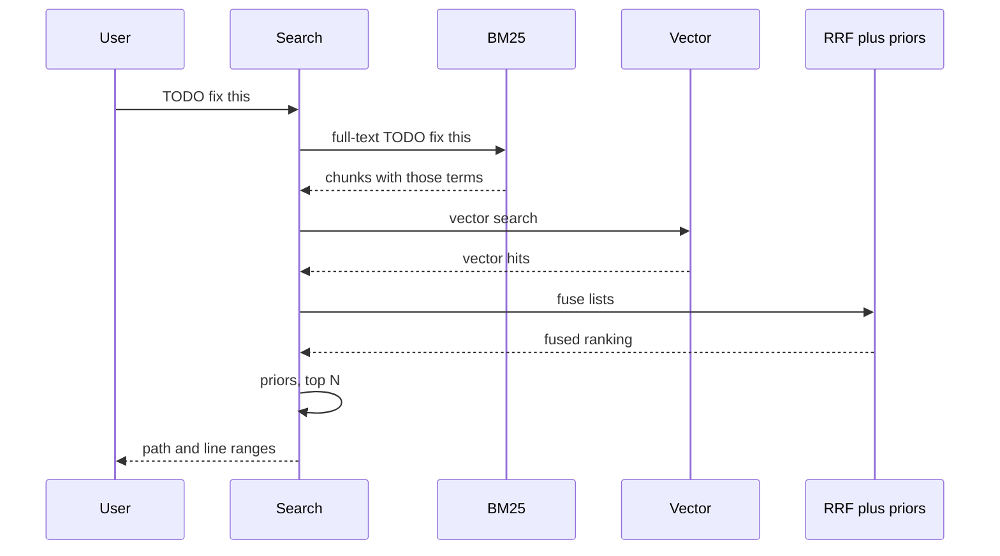
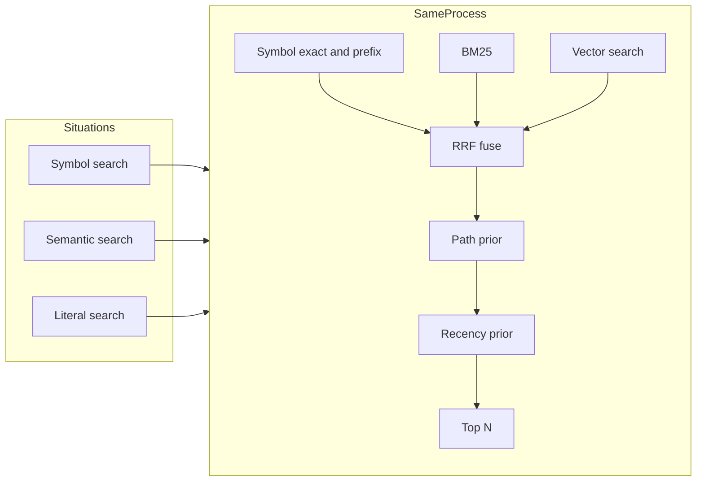

# SemanticFS

SemanticFS is a filesystem-wide intelligence layer for AI agents.
Currently (v1.x), SemanticFS is optimized for software repositories as we build toward full system-scope capabilities.
It keeps deterministic file truth (`/raw`) while adding semantic discovery (`/search`) and orientation summaries (`/map`).

## Purpose
Traditional agent tooling wastes turns finding context.
SemanticFS moves retrieval into a filesystem-shaped interface so agents can use normal file operations to get grounded results faster.

Core design goal:
1. Probabilistic discovery.
2. Deterministic verification before edits.

## Product Shape (v1.x)
SemanticFS is currently optimized for software repositories, not whole-machine indexing.

Provided surfaces:
1. `/raw/<path>`: byte-accurate passthrough.
2. `/search/<query>.md`: hybrid retrieval results with grounded paths/lines.
3. `/map/<dir>/directory_overview.md`: deterministic summaries with optional async enrichment.
4. MCP minimal server for agent discovery/use.

## Architecture

Request flow:
1. Files change in repo.
2. `indexer` updates metadata/symbols/vectors and publishes a new index version via two-phase publish.
3. `fuse-bridge` serves virtual paths against a snapshot.
4. `retrieval-core` executes symbol-first + BM25 + vector fusion and applies policy + ranking priors.
5. Agent verifies final edit targets through `/raw`.

Main crates:
1. `semanticfs-common`: shared config/types.
2. `policy-guard`: filtering, secret heuristics, redaction.
3. `indexer`: chunking/symbol extraction/embedding/map precompute/watch.
4. `retrieval-core`: hybrid planner + RRF + priors.
5. `map-engine`: map summary read path + enrichment merge.
6. `fuse-bridge`: virtual FS rendering + caches + stats.
7. `mcp`: minimal MCP-compatible tool/resource server.
8. `semanticfs-cli`: operational commands and benchmarks.

## How retrieval works

Search runs **symbol lookup**, **BM25**, and **vector search** in parallel, then fuses and re-ranks results. The diagrams below render on GitHub and other Mermaid-capable viewers.

### Retrieval pipeline



### Symbol search (e.g. function or class name)



### Semantic search (e.g. natural-language intent)



### Literal search (e.g. string in file)



### All query types use the same process



## Current State (As of February 28, 2026)
Implemented:
1. Core `/raw` + `/search` + `/map` behavior.
2. Snapshot versioning and two-phase publish.
3. Symbol-first hybrid retrieval (symbol + BM25 + vector).
4. Policy guard at indexing and retrieval/render.
5. Async `/map` enrichment worker.
6. MCP session pinning (`session_id`, `refresh_session`).
7. Branch-swap queue planning with in-progress status signaling.
8. Anti-shadowing ranking priors (file-type + recency).
9. FUSE long-lived session pinning with explicit refresh/status control files.
10. Benchmark suite: run/soak/relevance/release-gate/head-to-head.
11. Mounted Linux FUSE workflow validation for `/.well-known/session.json` and `/.well-known/session.refresh` in WSL long-lived session.
12. Strict daytime tune-vs-holdout workflow with deterministic suite splitting and holdout-only final reporting.
13. Phase 3 bootstrap has started in parallel: non-breaking multi-root domain config scaffolding plus filesystem domain-plan artifacts, while v1.x runtime remains single-root.

Known constraints:
1. Default embedding runtime is `hash` unless ONNX is configured.
2. FUSE mount path is Linux-only; Windows/macOS can still use indexing/retrieval/MCP/benchmarks.

## Quickstart
1. Build:
```bash
cargo build
```
2. Copy config and set repo path:
```bash
cp config/semanticfs.sample.toml local.toml
```
3. Build index:
```bash
cargo run -p semanticfs-cli -- --config local.toml index build
```
4. Start MCP server:
```bash
cargo run -p semanticfs-cli -- --config local.toml serve mcp
```
5. Run benchmark in release mode:
```bash
cargo run --release -p semanticfs-cli -- --config local.toml benchmark run --soak-seconds 30
```

## Validation Commands
1. Relevance:
```bash
cargo run --release -p semanticfs-cli -- --config local.toml benchmark relevance --fixture-repo /abs/repo --golden-dir tests/retrieval_golden --history
```
2. Head-to-head (SemanticFS vs `rg` baseline):
```bash
cargo run --release -p semanticfs-cli -- --config local.toml benchmark head-to-head --fixture-repo /abs/repo --golden-dir tests/retrieval_golden --history
```
3. Daytime smoke:
```powershell
powershell -ExecutionPolicy Bypass -File scripts/daytime_smoke.ps1 -SoakSeconds 2
```
4. Nightly sequence:
```powershell
powershell -ExecutionPolicy Bypass -File scripts/nightly_bench.ps1 -ConfigPath config/semanticfs.sample.toml -FixtureRepo tests/fixtures/benchmark_repo -GoldenDir tests/retrieval_golden -SoakSeconds 30
```
5. Representative nightly (semanticFS + ai-testgen suites + strict release gate):
```powershell
powershell -ExecutionPolicy Bypass -File scripts/nightly_representative.ps1 -SoakSeconds 30
```
6. Mounted Linux FUSE session validation (WSL):
```powershell
wsl -d Ubuntu -- bash -lc 'cd /mnt/c/path/to/semanticFS && bash scripts/wsl_run_fuse_session_validation.sh'
```
7. Drift summary (history counts + deltas + date coverage):
```powershell
powershell -ExecutionPolicy Bypass -File scripts/drift_summary.ps1
```
8. Daytime full action runner (split + smoke + tune/holdout + drift summary):
```powershell
powershell -ExecutionPolicy Bypass -File scripts/daytime_action_items.ps1 -SoakSeconds 2
```
Optional strict gate variant:
```powershell
powershell -ExecutionPolicy Bypass -File scripts/daytime_action_items.ps1 -SoakSeconds 2 -IncludeReleaseGate
```
9. Tune-vs-holdout selection on a repo:
```powershell
powershell -ExecutionPolicy Bypass -File scripts/daytime_tune_holdout.ps1 -Label repo -RepoRoot C:\path\repo -BaseConfig config/relevance-real.toml -TuneGolden tests/retrieval_golden/repo_tune.json -HoldoutGolden tests/retrieval_golden/repo_holdout.json -History
```
10. Deterministic split from bootstrap suite:
```bash
python scripts/split_golden_suite.py --input tests/retrieval_golden/repo_bootstrap.json --tune-output tests/retrieval_golden/repo_tune.json --holdout-output tests/retrieval_golden/repo_holdout.json --tune-count 10
```
11. Curated mixed split build from expanded bootstrap suite:
```bash
python scripts/build_curated_mixed_suites.py --input tests/retrieval_golden/repo_bootstrap_v2_full.json --tune-output tests/retrieval_golden/repo_curated_tune.json --holdout-output tests/retrieval_golden/repo_curated_holdout.json --split-size 40 --non-symbol-per-split 10 --dataset-prefix repo
```
12. Config-aligned bootstrap generation for a scoped repo:
```bash
python scripts/bootstrap_golden_from_repo.py --repo-root C:\path\repo --config config/relevance-ai-testgen.toml --output tests/retrieval_golden/repo_bootstrap.json --dataset-name repo_bootstrap_v1 --max-queries 20
```
Optional faster mode for large git repos:
```bash
python scripts/bootstrap_golden_from_repo.py --repo-root C:\path\repo --git-tracked-only --output tests/retrieval_golden/repo_bootstrap.json --dataset-name repo_bootstrap_v1 --max-queries 20
```
12. Filesystem candidate discovery (workspace mirrors excluded + remote dedupe by default):
```powershell
powershell -ExecutionPolicy Bypass -File scripts/discover_repo_candidates.ps1 -Roots C:\Users\<user> -MinTrackedFiles 80 -TopN 80 -OutputPath .semanticfs/bench/filesystem_repo_candidates_min80.json
```
13. Filesystem backlog build (prioritized uncovered/gap/partial/representative/ok queue):
```powershell
powershell -ExecutionPolicy Bypass -File scripts/build_filesystem_scope_backlog.ps1 -CandidatesPath .semanticfs/bench/filesystem_repo_candidates_min80.json -OutputPath .semanticfs/bench/filesystem_scope_backlog_latest.json
```
14. Phase 3 domain-plan build from latest backlog:
```powershell
powershell -ExecutionPolicy Bypass -File scripts/build_phase3_domain_plan.ps1 -BacklogPath .semanticfs/bench/filesystem_scope_backlog_latest.json -OutputPath .semanticfs/bench/filesystem_domain_plan_latest.json
```
15. Query gap report for targeted hardening:
```powershell
powershell -ExecutionPolicy Bypass -File scripts/build_query_gap_report.ps1 -DatasetName repo8872pp_bootstrap_v1_holdout_v1
```

## Documentation Map
Use these docs by role:
1. `docs/new-chat-handoff.md`: current status, exact next steps, execution order.
2. `docs/big-picture-roadmap.md`: multi-phase product direction and guardrails.
3. `docs/v1_2_execution_plan.md`: v1.2 scope, acceptance criteria, active work items.
4. `docs/phase3_execution_plan.md`: parallel Phase 3 bootstrap scope and execution order.
5. `docs/future-steps-log.md`: running backlog/history of discussed future work.
6. `docs/benchmark.md`: command reference and artifact semantics.
7. `docs/implemented-v1_1.md`: v1.1 implementation baseline.
8. `docs/release-v1_1_0-rc1.md`: release gate checklist.
9. `docs/README.md`: documentation index and read order.

## New Chat Bootstrap
If starting a fresh assistant chat, read in this order:
1. `README.md`
2. `docs/new-chat-handoff.md`
3. `docs/v1_2_execution_plan.md`
4. `docs/phase3_execution_plan.md`
5. `docs/future-steps-log.md`
6. `docs/benchmark.md`

This sequence is the source of truth for current priorities.
