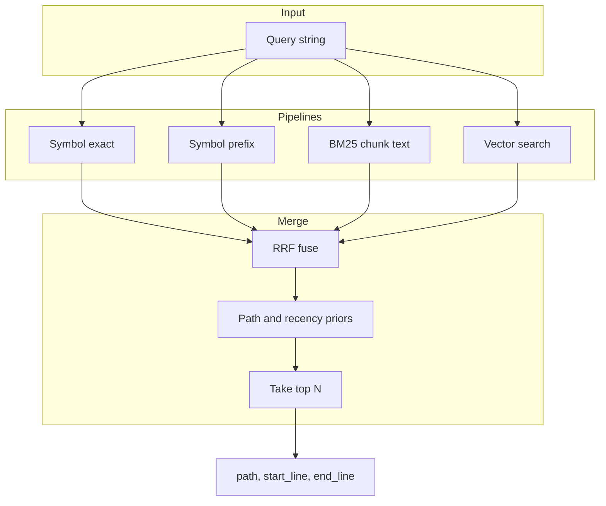
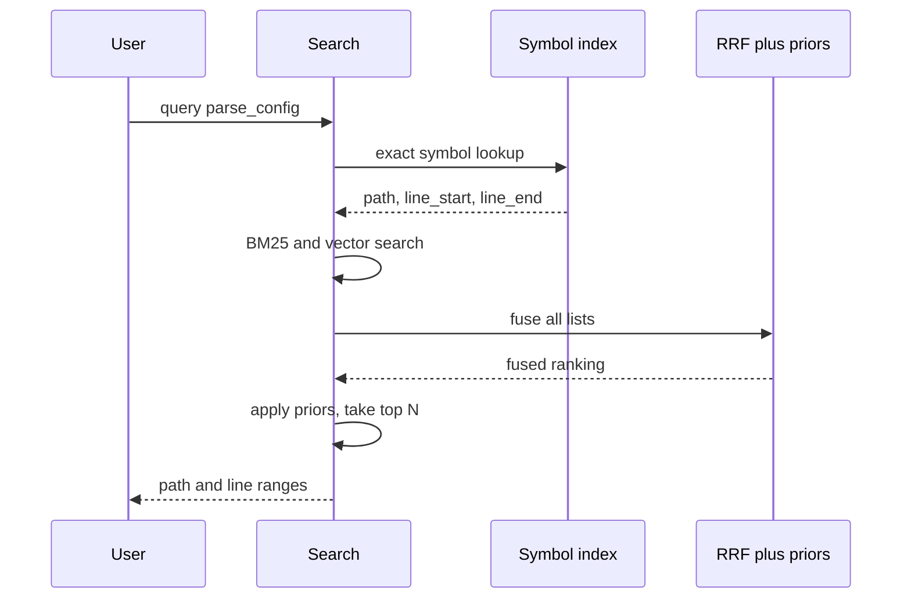
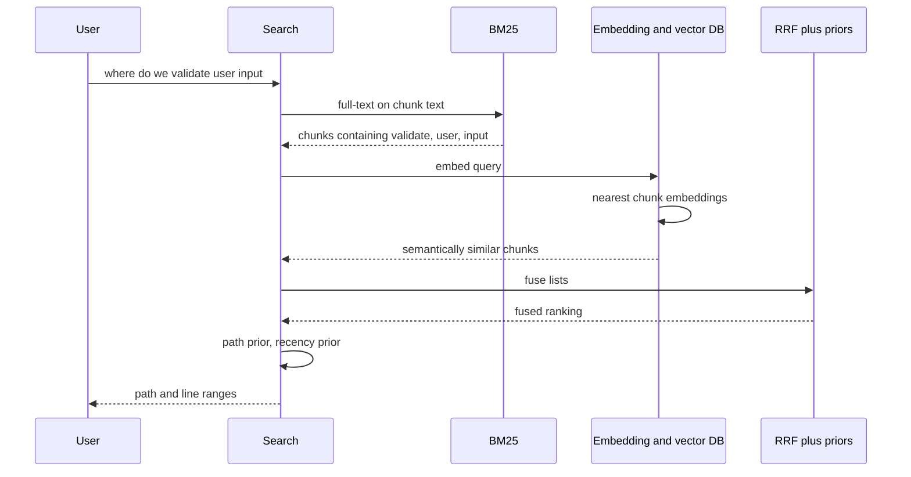
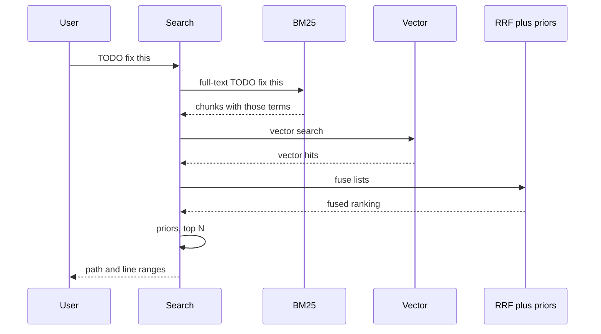
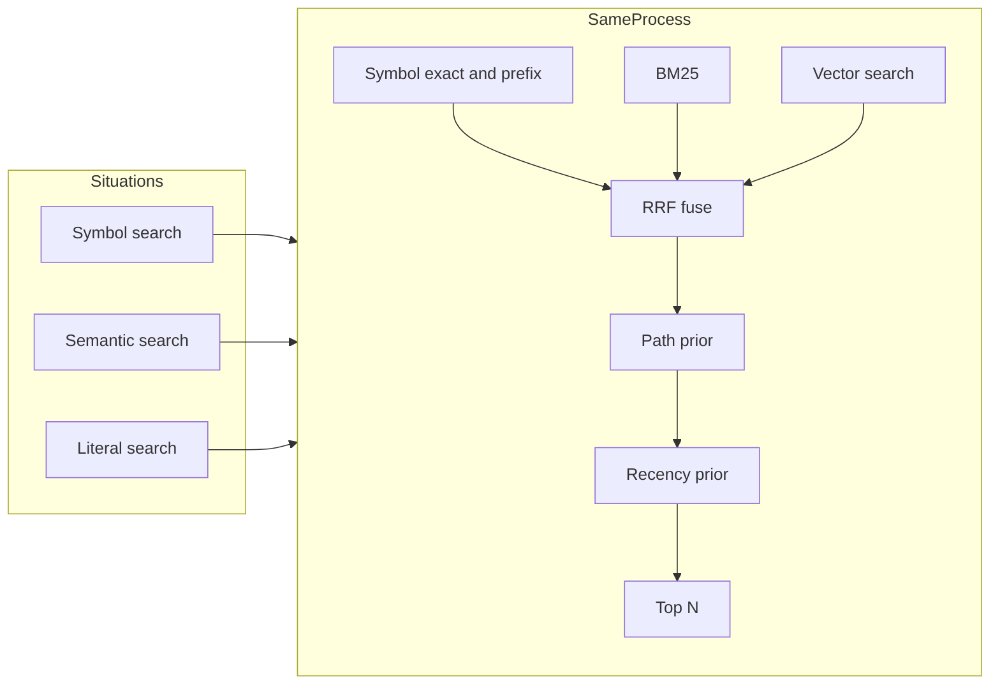

# SemanticFS

SemanticFS is a filesystem-wide intelligence layer for AI agents.
In `v1.x`, it is optimized for software repositories and bounded multi-root home profiles as the path toward broader system-scope usage.
It keeps deterministic file truth through `/raw` while adding semantic discovery through `/search` and orientation summaries through `/map`.

## Why it exists
Agents like OpenClaw, Claude Code, and Cursor waste time and tokens manually:
1. changing directories
2. listing folders
3. grepping for likely files

SemanticFS moves that retrieval work behind a filesystem-shaped interface so an agent can:
1. ask `/search` for relevant files first
2. get grounded paths and line ranges back
3. verify the final target through `/raw` before acting

Core design goal:
1. Probabilistic discovery.
2. Deterministic verification before edits.

## What you get
SemanticFS exposes four main surfaces:
1. `/raw/<path>`: byte-accurate passthrough of the real file.
2. `/search/<query>.md`: hybrid retrieval results with grounded paths and line ranges.
3. `/map/<dir>/directory_overview.md`: deterministic directory summaries with optional async enrichment.
4. MCP server: lets agents use SemanticFS as a tool/resource backend instead of manually navigating the tree.

## How agents use it
The intended flow is:
1. Agent asks SemanticFS where the relevant files are.
2. SemanticFS returns ranked candidates with grounded locations.
3. Agent reads the target through `/raw`.
4. Agent verifies before editing.

This is the point of `/search`: stop spending turns on blind navigation and move directly to likely files.

## Architecture

### Request flow
1. Files change in a configured root.
2. `indexer` updates metadata, symbols, chunks, and embeddings, then publishes a new snapshot.
3. `fuse-bridge` serves virtual paths against that snapshot.
4. `retrieval-core` executes symbol-first + BM25 + vector fusion and applies ranking priors.
5. Agent confirms the final target through `/raw`.

### Main crates
1. `semanticfs-common`: shared config and core types.
2. `policy-guard`: trust boundaries, filtering, redaction, and root/domain rules.
3. `indexer`: chunking, symbol extraction, embeddings, snapshot publish, and watch logic.
4. `retrieval-core`: hybrid retrieval planner, RRF fusion, and ranking priors.
5. `map-engine`: directory summary reads and enrichment merge.
6. `fuse-bridge`: virtual filesystem rendering, cache behavior, and stats.
7. `mcp`: minimal MCP-compatible server surface.
8. `semanticfs-cli`: operational commands, health checks, and benchmarks.

## How retrieval works
Search runs symbol lookup, BM25, and vector search in parallel, then fuses and re-ranks the results.
The diagrams below are unchanged and should render in GitHub or any Mermaid-capable viewer.

### Retrieval pipeline



### Symbol search (e.g. function or class name)



### Semantic search (e.g. natural-language intent)



### Literal search (e.g. string in file)



### All query types use the same process



## Current status
Implemented in the current release band:
1. Core `/raw`, `/search`, and `/map` behavior.
2. Snapshot versioning with two-phase publish.
3. Symbol-first hybrid retrieval.
4. Policy-aware multi-root ownership and trust boundaries.
5. Domain-aware `/raw` and `/map`.
6. MCP server for agent integration.
7. Benchmarks, relevance gates, and head-to-head validation.
8. A production-shaped bounded home profile (`home_profile_v1`) for practical home-directory usage.
9. Packaging, local install, and release-readiness smoke checks.

Known constraints:
1. Default embedding runtime is `hash` unless ONNX is configured.
2. FUSE mounting is Linux-first; Windows and macOS can still use indexing, retrieval, MCP, and benchmarks.
3. The recommended default is the bounded home profile, not an uncapped full-home crawl.

## Quickstart

### 1. Build
```bash
cargo build
```

### 2. Create a local config
```bash
cp config/semanticfs.sample.toml config/local.toml
```

Then set the root or domains you want SemanticFS to index.

### 3. Build the index
```bash
cargo run -p semanticfs-cli -- --config config/local.toml index build
```

### 4. Start the MCP server
```bash
cargo run -p semanticfs-cli -- --config config/local.toml serve mcp
```

### 5. Run a quick validation pass
```bash
cargo run --release -p semanticfs-cli -- --config config/local.toml benchmark run --soak-seconds 30
```

## Agent setup
Use SemanticFS with Claude Code, Cursor, OpenClaw, or any MCP-capable agent like this:
1. Run `serve mcp`.
2. Register the SemanticFS MCP endpoint in the agent.
3. Let the agent use SemanticFS search/resources instead of manual `cd` / `ls` / `grep`.
4. Have the agent verify final edit targets through `/raw`.

For a faster setup path, see `docs/setup_10_minute_agents.md`.

## Recommended profiles
The current practical defaults are:
1. `single-repo`: for one project root.
2. `multi-root-dev-box`: for a curated set of development roots.
3. `home-projects`: for a bounded home-plus-projects profile.

Sample profiles live in `config/profiles/`.
You can render them with:

```powershell
powershell -ExecutionPolicy Bypass -File scripts/apply_config_profile.ps1 -Profile single-repo -OutputPath .semanticfs/bench/local.single-repo.toml -RepoRoot (Get-Location).Path
```

## Common commands

### Health
```bash
cargo run -p semanticfs-cli -- --config config/local.toml health
```

### Relevance benchmark
```bash
cargo run --release -p semanticfs-cli -- --config config/local.toml benchmark relevance --fixture-repo /abs/repo --golden tests/retrieval_golden/semanticfs_multiroot_explicit_v14.json
```

### Head-to-head vs `rg`
```bash
cargo run --release -p semanticfs-cli -- --config config/local.toml benchmark head-to-head --fixture-repo /abs/repo --golden tests/retrieval_golden/semanticfs_multiroot_explicit_v14.json
```

### One-command release smoke
```powershell
powershell -ExecutionPolicy Bypass -File scripts/run_release_readiness.ps1 -OutputDir .semanticfs/bench -SkipBuild
```

### Local install
```powershell
powershell -ExecutionPolicy Bypass -File scripts/install_local.ps1 -InstallDir .semanticfs/local-bin-release -BinaryPath target/release/semanticfs.exe
```

## What is currently supported
The current supported production path is:
1. bounded multi-root repository usage
2. bounded multi-root home usage through `home_profile_v1`
3. packaged local usage through the release bundle and install scripts

The current release band is designed to be:
1. deterministic
2. policy-bounded
3. fast on warmed repeated-query paths

It is not positioned as:
1. automatic whole-machine indexing by default
2. unbounded home crawling as the recommended default

## Repo docs
If you need deeper operational detail:
1. `docs/setup_10_minute_agents.md`: quick setup with agents
2. `docs/current_execution_plan.md`: current implementation baseline
3. `docs/future-steps-log.md`: short active queue
4. `docs/benchmark.md`: benchmark command reference
