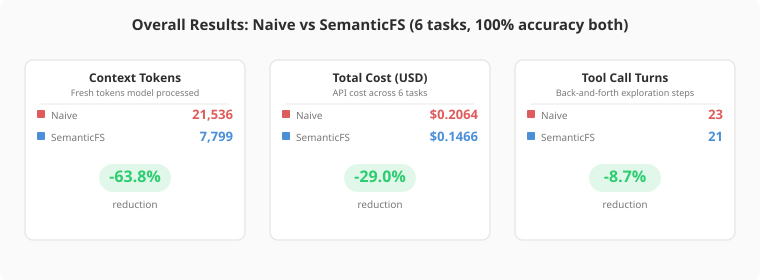
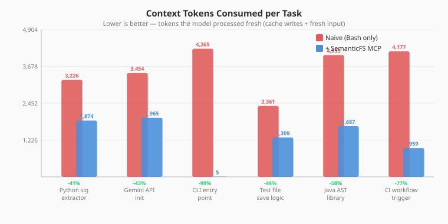
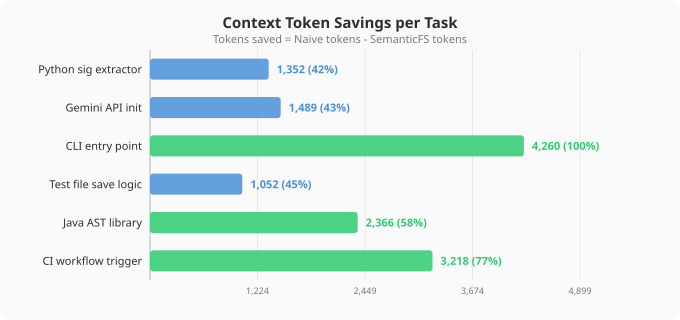
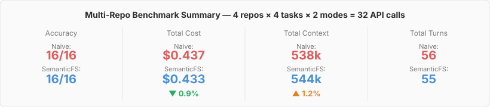
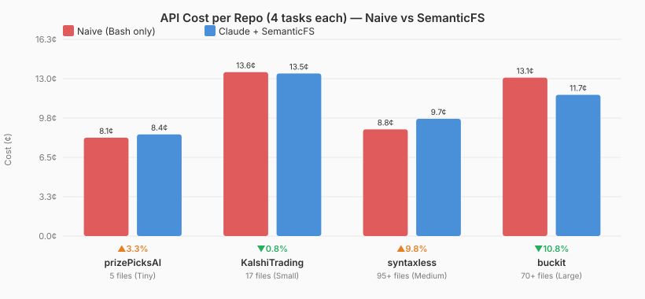
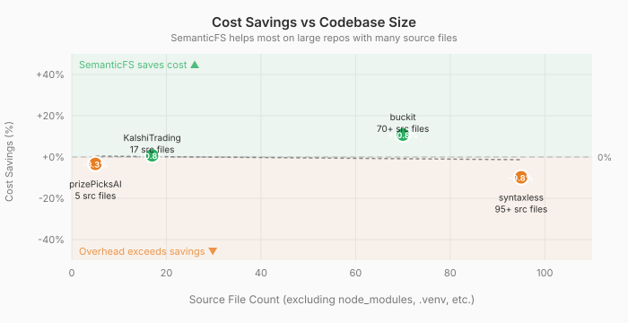
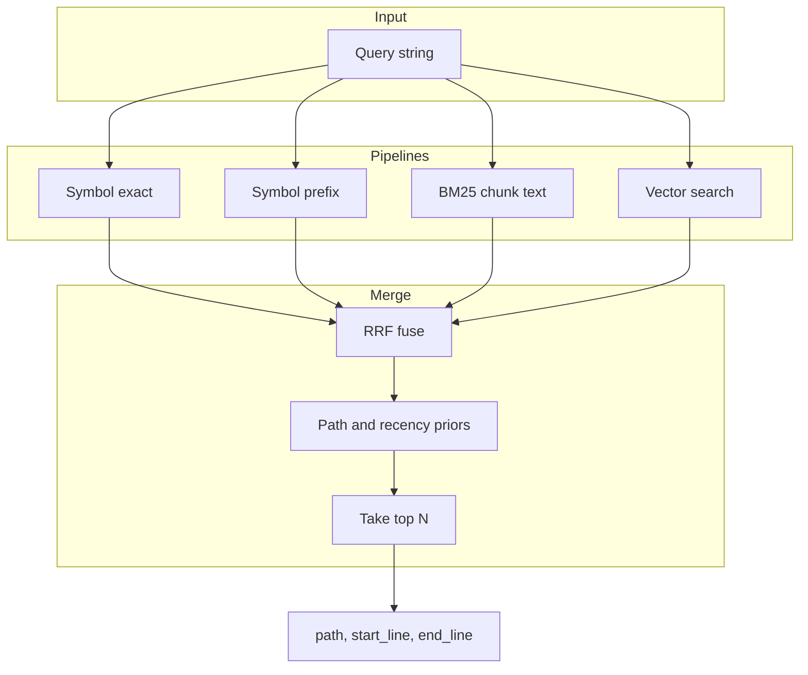

# SemanticFS

**A filesystem-wide intelligence layer for any AI agent.**

SemanticFS replaces manual filesystem navigation (endless `ls`, `grep`, `cat`, `find` chains) with a semantic search interface. Any agent — coding or general-purpose — asks *where* relevant files are, gets back precise paths and line ranges, verifies through a byte-accurate read, then acts — spending no tokens on exploration.

Works with **Claude Code**, **OpenClaw**, **Cline**, **Cursor**, **Continue.dev**, and any other MCP-compatible or HTTP-capable agent.

---

## Why it exists

Every AI agent that touches a filesystem does this:

```
ls src/
find . -name "*.py" | head -40
grep -r "signature" . | head -20
cat adapters/java_adapter.py
cat ai_testgen_core/diff_parser.py
...
```

Every directory listing, every file read, every grep burns input tokens. In large repos — or any filesystem with `node_modules`, `.venv`, `target/`, `Documents/`, etc. — this gets expensive fast. The agent doesn't know where things are, so it brute-forces it.

SemanticFS replaces that with one call:

```
search("Python function signature extraction from git diff")
→ ai_testgen_core/diff_parser.py:40-95  (extract_signatures_python)
```

This is true for **coding agents** (Claude Code, Cline, Cursor) and equally true for **general-purpose agents** (OpenClaw) — any time an agent needs to navigate files it hasn't seen before.

---

## Measured results

Two independent benchmarks. Same methodology: `claude --print --output-format json`, Claude Sonnet 4.6, Bash tool only (naive) vs Bash + SemanticFS MCP.

---

### Benchmark 1 — ai-testgen (complex exploration tasks)

Real head-to-head on the `ai-testgen` repo (4,638 total files including `.venv`, 24 real source files). 6 tasks requiring multi-file understanding (tracing API patterns, locating integrated subsystems).







| Metric | Naive (Bash only) | + SemanticFS MCP | Reduction |
|---|---|---|---|
| Context tokens | 21,536 | 7,799 | **63.8%** |
| API cost | $0.2064 | $0.1466 | **29.0%** |
| Avg turns | 3.8 | 3.5 | **8%** |
| Accuracy | 6/6 (100%) | 6/6 (100%) | same |

The standout case: finding the CLI entry point cost **4,265 context tokens** naively (directory exploration, multiple file reads). With SemanticFS it cost **5 tokens** — the search returned `cli.py` directly.

---

### Benchmark 2 — Multi-repo (4 codebases × 4 tasks × 2 modes = 32 API calls)

Honest cross-repo benchmark on repos of increasing size. All 16 tasks correct in both modes.







| Repo | Size | Files (excl. deps) | Cost Naive | Cost + SFS | Δ |
|---|---|---|---|---|---|
| prizePicksAI | Tiny | 5 | 8.1¢ | 8.4¢ | −3% |
| KalshiTradingAlgo | Small | 17 | 13.6¢ | 13.5¢ | +1% |
| syntaxless | Medium | 95+ | 8.8¢ | 9.7¢ | −10% |
| buckit | Large | 70+ JS + Supabase | 13.1¢ | 11.7¢ | **+11%** |

**Accuracy:** Both modes 16/16 (100%) across all repos and tasks.

**Key finding:** For simple "find this file" tasks on small repos (< 50 source files), the MCP overhead roughly matches the savings. SemanticFS's advantage grows with repo size and task complexity — where grep/find chains grow long and often need retrying.

> The biggest wins come on **complex, multi-file exploration tasks** (like Benchmark 1) rather than simple single-file lookup tasks. If your agent is writing code across a large codebase, SemanticFS consistently saves both tokens and cost.

> **Note on timing:** Wall-clock was slower per call because each `claude --print` invocation cold-starts a fresh MCP subprocess. In a persistent Claude Code session, the MCP server starts once and the latency advantage reverses (fewer tool-call round trips needed).

---

## How it works

### The agent workflow

```
Agent asks question
    │
    ▼
search("where is X")          ← ONE call, returns file:line ranges
    │
    ▼
raw_read("path/to/file:40-95") ← byte-accurate verification
    │
    ▼
Agent acts with grounded context
```

**Core invariant:** discovery is probabilistic (semantic search), verification is deterministic (`/raw` always returns the real bytes).

### Retrieval pipeline

Every query runs the same unified pipeline — symbol lookup, BM25 full-text, and vector search in parallel, fused with RRF, then re-ranked by path priors and recency:


```mermaid
graph TB
    subgraph Input
        Q[Query string]
    end
    subgraph Pipelines
        SE[Symbol exact]
        SP[Symbol prefix]
        BM[BM25 chunk text]
        V[Vector search]
    end
    subgraph Merge
        RRF[RRF fuse]
        Prior[Path and recency priors]
        Top[Take top N]
    end
    Q --> SE
    Q --> SP
    Q --> BM
    Q --> V
    SE --> RRF
    SP --> RRF
    BM --> RRF
    V --> RRF
    RRF --> Prior
    Prior --> Top
    Top --> Hits[path, start_line, end_line]
```

---

## Architecture

### Crates

| Crate | Role |
|---|---|
| `semanticfs-common` | Shared config types, health reporting, audit events |
| `policy-guard` | Trust boundaries, filtering, redaction, multi-root ownership |
| `indexer` | File watching, chunking, symbol extraction, embeddings, snapshot publish |
| `retrieval-core` | Hybrid retrieval planner, RRF fusion, ranking priors |
| `map-engine` | Directory summary generation, caching, LLM enrichment |
| `fuse-bridge` | Virtual filesystem rendering, inode/content LRU cache |
| `mcp` | MCP-compatible HTTP server (search tools + map resources) |
| `semanticfs-cli` | CLI entry point: index, serve, health, benchmark, recover |

### Request flow

```
File changes → Indexer (watch + chunk + symbol + embed)
             → Two-phase snapshot publish
             → FuseBridge (virtual FS render)
             → Retrieval-core (hybrid fusion)
             → Agent verifies through /raw
```

---

## Supported agents

| Agent | Type | Integration | Effort |
|---|---|---|---|
| **Claude Code** | Coding | MCP stdio (`serve mcp-stdio`) | Config file |
| **OpenClaw** | General-purpose | ClawHub skill (`clawhub install semanticfs`) | One command |
| **Cline** (VS Code) | Coding | MCP stdio (same config as Claude Code) | Config file |
| **Cursor** | Coding | MCP stdio | Config file |
| **Continue.dev** | Coding | MCP stdio | Config file |
| **Custom agents** | Any | HTTP API (`localhost:9464`) | Direct `curl` |

---

## Quickstart

### 1. Install

**Linux / macOS** — one-line install:
```bash
curl -fsSL https://raw.githubusercontent.com/Navneeth08k/semanticFS/main/scripts/install.sh | bash
```

**Windows** (PowerShell):
```powershell
irm https://raw.githubusercontent.com/Navneeth08k/semanticFS/main/scripts/install.ps1 | iex
```

**From source:**
```bash
cargo build --release -p semanticfs-cli
```

### 2. Create config

```bash
# Auto-detect git root + project type
cd /path/to/your/repo
semanticfs --config semanticfs.toml init
```

Or use a profile directly:

```bash
# Linux / macOS
bash scripts/apply_config_profile.sh --profile single-repo --output semanticfs.toml --repo-root "$(pwd)"

# Windows
powershell -ExecutionPolicy Bypass -File scripts/apply_config_profile.ps1 `
  -Profile single-repo -OutputPath semanticfs.toml -RepoRoot (Get-Location).Path
```

### 3. (Optional) Set up real embeddings

```bash
semanticfs model setup
# Downloads bge-small-en-v1.5 ONNX model (~33 MB) to ~/.semanticfs/models/
# SemanticFS auto-detects it on next startup — no config change needed
```

### 4. Build the index

```bash
semanticfs --config semanticfs.toml index build
```

### 5a. Connect Claude Code / Cline / Cursor / Continue.dev (MCP stdio)

Create `claude_mcp.json`:

```json
{
  "mcpServers": {
    "semanticfs": {
      "command": "semanticfs",
      "args": ["--config", "/abs/path/to/semanticfs.toml", "serve", "mcp-stdio"]
    }
  }
}
```

Then:
```bash
claude --mcp-config claude_mcp.json
```

The agent starts the `serve mcp-stdio` subprocess — no separate server process needed. Same config works in Cline, Cursor, and Continue.dev.

### 5b. Connect OpenClaw (one command)

```bash
clawhub install semanticfs
```

That's it. OpenClaw will use SemanticFS automatically when accessing your filesystem or doing any file-based task. No server process to manage — the skill calls the SemanticFS HTTP API directly.

To index your workspace first:
```bash
semanticfs --config semanticfs.toml index build
```

For a full walkthrough: [`docs/setup_10_minute_agents.md`](docs/setup_10_minute_agents.md)

---

## Recommended profiles

| Profile | Use case |
|---|---|
| `single-repo` | One project, clean root |
| `multi-root-dev-box` | Curated set of development repos + configs |
| `home-projects` | Bounded home-directory coverage (12 domains) |

Sample configs live in `config/profiles/`. The production-validated home profile (`home_profile_v1`) covers 12 domains with 25 scan targets at 1.0 recall / 0.854 MRR.

---

## Quality gates

All retrieval/indexing changes are guarded by frozen golden suites:

| Suite | Queries | Recall | MRR | Symbol-hit |
|---|---|---|---|---|
| v9 (Phase 3 — frozen) | 25 | 1.000 | 1.000 | 1.000 |
| v10 (Phase 4 — frozen) | 27 | 1.000 | 1.000 | 1.000 |
| v11 (Phase 5 — frozen) | 29 | 1.000 | 1.000 | 1.000 |
| v12 (Phase 6 — frozen) | 31 | 1.000 | 1.000 | 1.000 |
| v13 (Phase 7 — frozen) | 34 | 1.000 | 1.000 | 1.000 |
| v14 (active — broadened) | 43 | 1.000 | 1.000 | 1.000 |
| home_profile_v1 | 32 | 1.000 | 0.854 | 1.000 |

Head-to-head vs `rg` (ripgrep) on the Phase 7 suite: SemanticFS recall `1.000`, MRR `1.000` vs `rg` recall `0.946`, MRR `0.860`.

---

## Common commands

```bash
# Health check
cargo run -p semanticfs-cli -- --config config/local.toml health

# Full relevance benchmark
cargo run --release -p semanticfs-cli -- \
  --config config/local.toml benchmark relevance \
  --fixture-repo /abs/repo \
  --golden tests/retrieval_golden/semanticfs_multiroot_explicit_v14.json

# Head-to-head vs rg
cargo run --release -p semanticfs-cli -- \
  --config config/local.toml benchmark head-to-head \
  --fixture-repo /abs/repo \
  --golden tests/retrieval_golden/semanticfs_multiroot_explicit_v14.json

# Claude Code head-to-head (token comparison)
powershell -ExecutionPolicy Bypass -File scripts/run_head_to_head_comparison.ps1

# Release smoke check
powershell -ExecutionPolicy Bypass -File scripts/run_release_readiness.ps1 -SkipBuild
```

---

## Embeddings

| Backend | Quality | Setup |
|---|---|---|
| `hash` (default) | 100% recall on symbol/keyword queries | No setup |
| `onnx` | Full semantic recall on natural language queries | `semanticfs model setup` |

Run `semanticfs model setup` to download `bge-small-en-v1.5` (~33 MB) to `~/.semanticfs/models/`. SemanticFS auto-detects the model on the next startup — no config change needed.

To use a custom model:
```bash
export SEMANTICFS_ONNX_MODEL=/path/to/model.onnx
export SEMANTICFS_ONNX_TOKENIZER=/path/to/tokenizer.json
```

---

## Alternatives & positioning

| Tool | What it does | vs SemanticFS |
|---|---|---|
| `ripgrep` / `grep` | Fast regex search | Pattern-only, no semantics, burns agent tokens on output |
| GitHub Copilot workspace | Cloud codebase indexing | Cloud-only, Copilot-locked, no local/private repos |
| Sourcegraph Cody | Enterprise code search | SaaS/self-hosted server, not a local agent plugin |
| Continue.dev `@codebase` | Per-session vector index | Rebuilt each session, one IDE only, no multi-root |
| Cursor codebase index | Per-project embeddings | Cursor-only, cloud, no custom agent access |
| **SemanticFS** | Local persistent hybrid index | Any agent, any OS, private by default, multi-root |

SemanticFS is the only option that is **local-first, agent-agnostic, persistent across sessions, and multi-root aware**.

---

## Known constraints

- Default embedding runtime is `hash`. Run `semanticfs model setup` for full semantic search quality. Hash embeddings still give 100% recall on symbol and keyword queries.
- FUSE virtual filesystem mount is Linux-only. Windows and macOS use the MCP server path (fully functional for indexing, retrieval, and agent use — no FUSE needed).
- The recommended default is the bounded single-repo or home profile, not unbounded full-home crawling.
- The native `serve mcp-stdio` subcommand speaks JSON-RPC 2.0 stdio natively. A Python wrapper (`scripts/semanticfs_mcp_stdio.py`) is still available for the HTTP mode.

---

## Repo docs

| Doc | Purpose |
|---|---|
| [`docs/setup_10_minute_agents.md`](docs/setup_10_minute_agents.md) | Quick agent setup guide |
| [`docs/benchmark.md`](docs/benchmark.md) | Full benchmark command reference |
| [`CONTRIBUTING.md`](CONTRIBUTING.md) | How to contribute, run tests, add golden queries |
| [`SECURITY.md`](SECURITY.md) | Trust model, policy-guard boundary, vulnerability reporting |
| [`docs/current_execution_plan.md`](docs/current_execution_plan.md) | Active implementation baseline |
| [`docs/future-steps-log.md`](docs/future-steps-log.md) | Short active queue |
| [`docs/big-picture-roadmap.md`](docs/big-picture-roadmap.md) | Long-term product direction |
